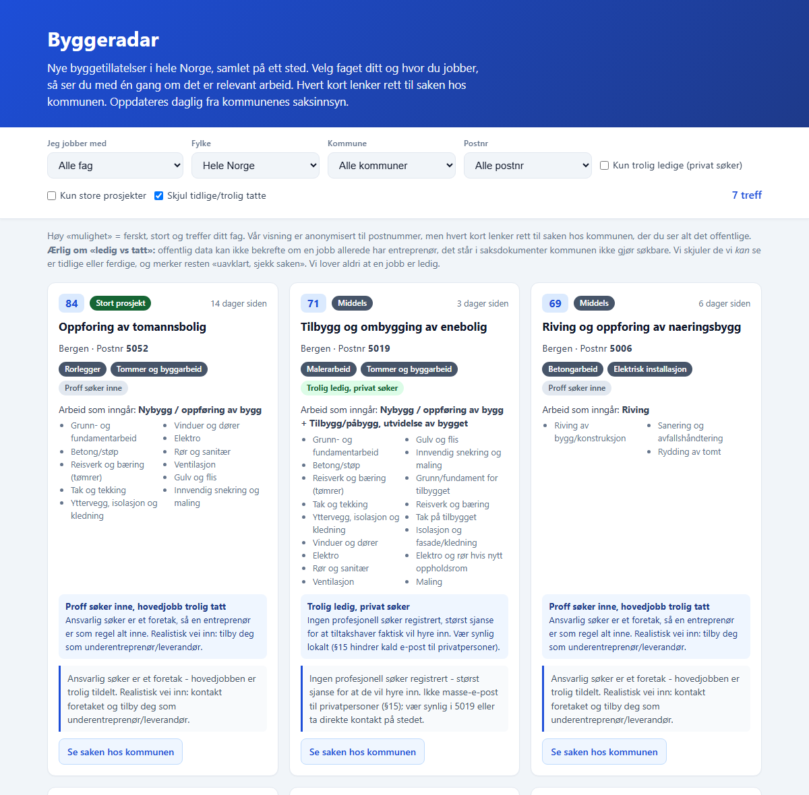

# Byggeradar

Landsdekkende oversikt over nye byggetillatelser, sortert etter hvilke prosjekter som faktisk er verdt tiden til en håndverker. Kommunene publiserer alt, men i en form ingen orker å lese. Byggeradar leser det for deg og løfter fram de få sakene som treffer faget ditt.



*Skjermbildet viser den faktiske appen kjørt med eksempeldata.*

## Status og tall

| | |
|---|---|
| Dekning | Hele Norge. Én kildeadapter per kommune, pilot mot Bergen |
| Mulighetsscore | 0 til 100, vektet på fagtreff, prosjektstørrelse og ferskhet |
| Tester | 12, alle grønne |
| Kodebase | ca. 3 300 linjer Python |
| Personvern | Tiltakshaver leses aldri. Visningen er anonymisert til postnummer |

## Teknologi

Python og pandas. Streamlit for den interaktive visningen, og en statisk HTML-side som kan hostes gratis og deles med en lenke. Adapterarkitektur i `kilder/`, så en ny kommune legges til uten å røre resten.

## Slik virker det

Hver sak klassifiseres på skala (stor, middels, lite tiltak) ut fra arbeidsbeskrivelsen, aldri ut fra hvem som søker. Så regnes en mulighetsscore, og hvert kort får et ærlig handlingstips: står det et foretak som ansvarlig søker, er jobben trolig tildelt og veien inn er å tilby seg som underentreprenør. Står det ingen profesjonell søker, er sjansen større for at de skal hyre inn.

Hvert kort lenker rett til kommunens egen saksside, så du kan sjekke alt selv.

## Om testingen

Claude Code skriver koden. Jeg bestemmer hva som skal bygges, og jeg kontrollerer at det stemmer.

`test_feed_filtre.py` kjører 12 tester. De sammenligner hvert eneste filter mot manuell filtrering av det samme datasettet, sjekker at lenken til kommunen er en ekte http-adresse, og passer på at full gateadresse aldri lekker ut i visningen. `selftest.py` og `helsesjekk.py` sjekker at pipelinen henger sammen.

Grunnen til at filtertestene finnes er enkel. Et filter som vises i grensesnittet er ikke det samme som et filter som virker, og forskjellen ser du ikke ved å lese koden.

## Beslutningen som formet produktet

Første versjon solgte kalde leads for 99 kroner stykket. Jeg skrotet hele modellen etter å ha testet den.

Årsaken var tre funn som til sammen gjorde produktet verdiløst og delvis ulovlig: kilden inneholder ingen kontaktinformasjon vi lovlig kan gi videre, siden tiltakshaver er en privatperson. Jobben er ofte allerede kontrahert når saken blir offentlig. Og bare 6 prosent av bedriftene var lovlig e-postbare etter markedsføringsloven §15. Det jeg egentlig solgte var en betalingsmur foran offentlig informasjon.

Ny retning er et gratis verktøy som kuraterer. Betaling kommer eventuelt senere som et abonnement på tidlig varsling, og først når nok folk faktisk bruker det.

## Kjøre det

```bash
pip install -r requirements.txt

python build_feed_html.py     # bygger og åpner en statisk side
streamlit run finn_feed.py    # interaktiv visning med filtre
python test_feed_filtre.py    # 12 tester
```
